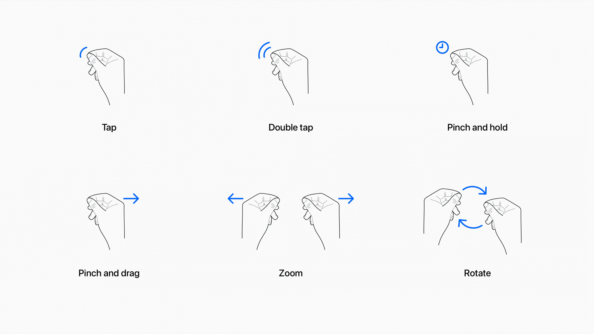
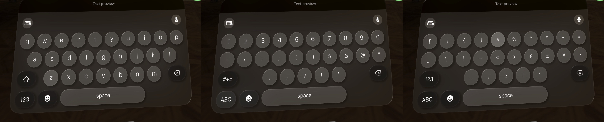
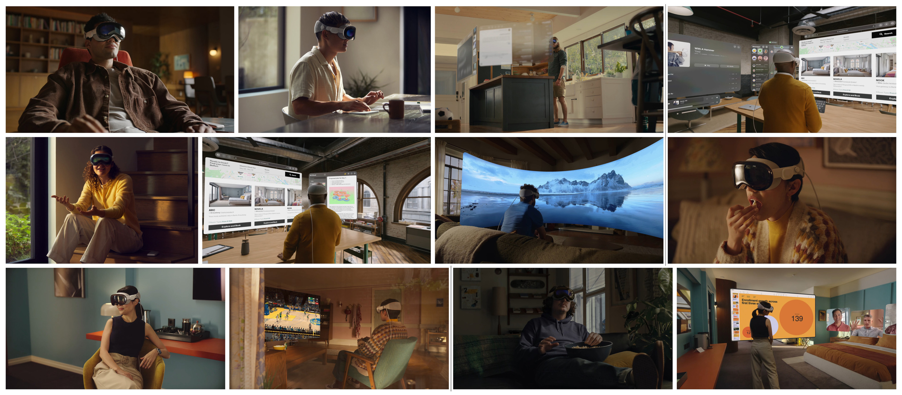

Does your back hurt? Or maybe it's your neck? Or perhaps your hands? Maybe it's your eyes. If you've been using computers daily for long enough, something probably hurts.

For me, it's my back. I suffer from chronic and mysterious lumbar and pelvic pain. I have consulted many specialists and undergone many tests and scans, but none have been able to ease the pain or even give me a firm diagnosis.

Only one thing reliably soothes the pain: movement. Sitting in a chair is the worst, but remaining in any fixed position for more than roughly 30 minutes (or little as 10 minutes on a bad day) will trigger significant discomfort or pain.

This condition has heightened my sensitivity to the physical toll that conventional computing imposes on the human body. While my situation may be more acute, prolonged unnatural behaviors wear down all bodies over time. The repercussions may not be immediate, but eventually, the human body is unable to overcome such impositions. My body is the canary in the computing coal mine, but you are likely with me in the same mine. 

<aside class="flex px-4 py-4 rounded-lg bg-primary-100 dark:bg-primary-900">

_If you might have insights about what could cause chronic lumbar/sacral pain that improves with movement and worsens with inactivity or colon fullness, please read this footnote: [^chronic-pain]_

</aside>

[^chronic-pain]: I'd be grateful for any leads that might steer me toward a diagnosis. The onset of my chronic lumbar/sacral pain dates back to 2019. Manifesting as a constant, diffuse ache originating from the lower back or sacrum, the pain lessens with physical activity and after bowel movements. Extended periods of immobility, particularly sitting, as well as normal colon fullness, exacerbate the pain. I have sought opinions from many physical therapists (including pelvic floor specialists), a sports medicine doctor, an orthopedic surgeon, two gastroenterologists, two pain management doctors, a rheumatologist, and several general practitioners. I have undergone a lumbar X-ray, multiple MRIs of my lumbar, pelvis, and sacroiliac joints, a colonoscopy, extensive blood tests for autoimmune markers, and epidural steroid injections into L5-S1 (where I have a 2mm broad-based disc protrusion). However, test results have been largely unremarkable, and no intervention has proven effective. Most recently, I did an ultrasound of my sacroiliac joints, which unexpectedly found inflammation of the sacroiliac ligaments. Steroid injections into the ligaments seem to have helped slightly, which is my best lead so far, so I am pursuing the hypothesis that all of this is somehow caused by sacroiliac ligament inflammation. If you have any suggestions, please contact me through the social media links on this website or via email at my firstName@thisDomain.

## Humane Computing

> "What a computer is to me is it’s the most remarkable tool that we've ever come up with, and it's the equivalent of a bicycle for our minds."
> --- <cite>Steve Jobs</cite>

While computers can provide a workout for the mind, computing is a detrimental habit for all but the mind. These brain bicycles are harmful for all other parts of our bodies. 

The technology that we have integrated into our lives is often a double-edged sword. The convenience and empowerment it provides comes at the expense of our health. The toll of prolonged usage is often high and invisible until significant interest has accrued. We are collectively suffering from Stockholm syndrome, in which our captors have ensnared us into a life of physical pain and discomfort that we gladly endure for the sake of convenience and productivity.

To define "humane", dictionaries often refer to traits such as compassion, benevolence, and the minimization of pain. I am not aware of this applied to computing at large, so I would like to contribute a new term to our lexicon: "humane computing"[^humane-interface]. I will define humane computing as a form of computing that either mitigates or eliminates the detriments associated with prolonged usage. Humane computing, as an ideal, asks for technology to be built in tandem with our human attributes---requiring adaptation from, and not to, technology. Our technology should, as with medicine, first do no harm.

[^humane-interface]: Not to be confused with [The Humane Interface by Jef Raskin](https://en.wikipedia.org/wiki/The_Humane_Interface), the creator of the Apple Macintosh. The Humane Interface is concerned primarily with visual UI, while humane computing is more holistic and concerned with physical harm.

When I refer to "computing", my focus is on tasks that demand intellectual engagement and creativity. Examples include coding, crafting written content, conducting research, graphic designing, and editing videos or images. These pursuits necessitate intricate interactions between the user and the computer, often over extended time frames. In contrast, activities that are predominantly about consumption, such as casually scrolling through TikTok, Reddit, or the like, and occasionally leaving comments, don't fall under the umbrella of "computing" in the context of this article.

## One more thing…

> "[…] in the same way that Mac introduced us to personal computing, and iPhone introduced us to mobile computing, Apple Vision Pro will introduce us to spatial computing. This marks the beginning of a journey that will bring a new dimension to powerful personal technology."
> --- <cite>Tim Cook, [WWDC23 Keynote](https://www.youtube.com/live/GYkq9Rgoj8E?feature=share&t=5028)</cite>

Our conscious experience of reality evolved over many millions of years to move our body through space and understand how other objects spatially relate to our body. Short of direct neural interface, spatial computing could be the final form of computing, not just the next form of computing. Therefore, spatial computing should, in theory, be the most humane form of computing as it most closely aligns with our evolutionary heritage. 

I was very excited by Apple's announcement of the Vision Pro at WWDC23. But it may not live up to my initial excitement.[^sources] Let's dig in and see. We'll look at three broad areas for humane computing: eye health, hand health, and body health, as well as general practicality for computing.

[^sources]: Though I was not fortunate enough to experience one of the private 30-minute demos at WWDC, my analysis is informed by reports from those demos, the WWDC keynote, WWDC [developer videos](https://developer.apple.com/wwdc23/topics/spatial-computing/), insights from Apple employees in the relevant WWDC Slack channel, and playing with the Vision Pro simulator.

### Myopia Menace

> "It's the first Apple product you look through and not at." 
> --- <cite>Tim Cook, [WWDC23 Keynote](https://www.youtube.com/live/GYkq9Rgoj8E?feature=share&t=4962)</cite>

Technically, you look through it in the same way you look through an iPhone camera viewfinder, but it's a good line. And it may be very important.

Our eyes need variety. When focusing on our screens, our focal distance is very near and usually fixed. We rarely adjust the distance between our screen and our eyes. But we've evolved to focus at a variety of distances. By neglecting to do so, our eyes atrophy.

Staring at screens for extended periods, especially close-up, has been linked to an increase in [nearsightedness](https://www.mayoclinic.org/diseases-conditions/nearsightedness/symptoms-causes/syc-20375556). It's alarming that [myopia is expected to affect more than half the world's population by 2050](https://www.weforum.org/agenda/2022/11/short-sightedness-cases-rising-globally/). The broad category for this and other related issues is called [computer vision syndrome](https://en.wikipedia.org/wiki/Computer_vision_syndrome) (CVS). CVS affects about 90% of people who use a computer screen for three or more hours per day. If you work with computers, you probably average well over three hours per day. I certainly do.

What would the ideal humane computing device look like in terms of eye health? 

1. The device should be varifocal, allowing the user to focus on real and virtual objects at a variety of distances. Further, the software should encourage virtual objects of significance to be placed at a variety of distances, thereby encouraging the user to regularly change their focal distance and maintain healthy eyes. 
2. Perhaps it goes without saying, but the device needs to have visual fidelity such that it is usable for most types of general computing. This is a tall order, as the current state of VR is not conducive to work. In other words, images need to be sharp so that text and small details are easily legible.
3. Additionally, though not directly related to eye health, a significant contributor to our overall health is our sleep quality and quantity, which is largely controlled by our circadian rhythm, which in turn is heavily regulated by light exposure. The type and amount of light that hits our eyes, particularly in the morning and evening, is crucial for maintaining a healthy circadian rhythm. As such, this is something that any humane computing device with visual output should consider.

Let's take those in order.

One might think that having screens mere inches away from the eyes would be worse than the status quo. However, the eye health issue is related to focal distance, not screen distance---a crucial distinction.

In VR, focal distance can be much further than traditional screens. Additionally, virtual screens can be independently positioned along the Z axis, potentially leading to healthy variation in focal distance. So since VR screens are perceptually further than physical laptop/desktop screens, they should be better for preventing myopia, right? Maybe...

The issue is [vergence-accommodation conflict](https://en.m.wikipedia.org/wiki/Vergence-accommodation_conflict) (VAC). Essentially, there are two kinds of focus: vergence and accommodation. If you imagine lasers coming out of your eyes like Superman, vergence changes where the two laser beams merge. To look at nearby targets, your eyes converge; to look at distant targets, your eyes diverge. The other kind of focus is accommodation, which is how your eyes focus individually by changing optical power using tiny ocular muscles. In the real world, vergence and accommodation synchronize. But not in VR, where accommodation is fixed but vergence varies.

")

In Vision Pro, accommodation is set at a fixed distance of about two meters. Additionally, Apple is trying to keep most of the variable vergence distance near the fixed accommodation distance via default window placement and design guidelines, though it's not clear how well this will work in practice. But the status quo is pretty bad, being mostly fixed vergence and accommodation (but synchronized) at a distance of about 0.5 meters. So the decision is between slightly variable near focal distance or partially fixed partially variable medium focal distance. 
 
It's not clear yet which is better for long-term eye health. It's possible that Vision Pro with VAC will be better for eye health than the status quo. It's also possible that it could be disastrous when used for prolonged periods. There don't seem to be any long-term studies on VAC and adult eye health. Perhaps this is because there hasn't been a consumer VR product that is usable for work. The Vision Pro will hopefully lead to more research on this topic.

Eventually, we need varifocal optics, which will resolve VAC by allowing natural synchronization of vergence and accommodation. This may be the biggest open question for the Vision Pro and humane computing. For my personal case, where I am significantly less concerned about eye health than other physical health, this is a tradeoff worth making. But for those inversely inclined, consider waiting to learn the potential long-term risks of the Vision Pro before abandoning the status quo.

Now, let's consider visual fidelity. I have a [Meta Quest 2](https://www.meta.com/quest/products/quest-2/) VR headset. I love it for cardio-style fitness gaming. I hate it for work, despite trying multiple times. The primary issue is insufficient resolution, especially for handling text. To comfortably read text, the human eye needs at least 40 pixels per degree (PPD). The Quest 2 sits at half that benchmark---a mere 20 PPD. Even the [Quest Pro](https://www.meta.com/quest/quest-pro/) has only about [22 PPD](https://www.uploadvr.com/meta-retinal-resolution-product-roadmap/).

We do not know the PPD of the Vision Pro. However, [based on initial analysis, it could be as high as 40 PPD](https://www.hypervision.ai/apple-vp-optics-insights). Based on reports of those who have used it, there don't seem to be any issues reading text. It might not be retina quality yet, but it seems to be easily usable. Fantastic!

Last, turning to circadian rhythm, there isn't much known about this yet, but we can make some educated guesses based on Apple's other products. Apple has something called [Night Shift, which "automatically shifts the colors of your display to the warmer end of the color spectrum after dark"](https://support.apple.com/en-us/HT207513). The Vision Pro will probably support Night Shift. Unfortunately, Night Shift isn't sufficient, and this is even more important with a device like the Vision Pro which completely blocks external light. In the morning, our eyes need very bright light to kickstart the daily cycle, while in the evening our eyes need very dim non-blue light to wind down and prepare for sleep. Device screens are not bright enough to provide the necessary light in the morning and are too bright in the evening. In other words, the Vision Pro should probably not be worn first thing in the morning (go outside and get some real sunlight) or in the evening (preferably don't use any screens or non-red lights). Not a deal-breaker by any means, but something to be aware of.

### Finger Fatigue

Variety is the spice of life, and this holds true for movement as well. We are built for diverse movements, but computing forces us into monotonous unnatural movements.

The traditional input methods, primarily keyboards and mice or trackpads, confine us to a 2D plane. Repetitive movements in constrained positions lead to ailments like repetitive strain injury (RSI) and carpal tunnel syndrome (CTS). Our wrists and fingers weren't designed for the repetitive rigidity these devices demand. Unsurprisingly, [many famous programmers have RSI.](http://xahlee.info/emacs/emacs/emacs_hand_pain_celebrity.html)

The Vision Pro headset supports a variety of input methods, including gaze tracking for pointing, hand tracking for gestural actions, and dictation for text input, as well as a virtual keyboard, and bluetooth devices like keyboards, mice/trackpads, and game controllers. 

Hand gestures are used for tapping, rotating, and various other common but lightweight actions.[^thinking-with-your-hands] [This video](https://developer.apple.com/videos/play/wwdc2023/10073/) is helpful for understanding the default input methods.

[^thinking-with-your-hands]: Though it is generally underappreciated, we humans [think with our hands](https://www.amazon.com/Thinking-Your-Hands-Surprising-Gestures/dp/1541600800) to a significant degree. It's interesting to speculate how converting hand gestures into virtual actions might affect our thinking. For example, perhaps we begin making fewer hand gestures when thinking so as to not accidentally trigger Apple's known gesture recognition, but by limiting our hand motion we subtly limit our thought processes as well. Or perhaps hand gestures which cause real effects improve our ability to think in general. We don't know yet. Interesting food for thought though...

Reports have been very positive about the experience of using hand gestures for performing actions in visionOS. Similarly, reports have universally praised the eye tracking, some calling it borderline telepathic or magical. Optimistically, it seems like Apple solved the cursor movement problem, obviating the need for a mouse/trackpad. This seems like a huge win for humane computing. Of course, this may not work well for fine-grained cursor movement as might be needed in some domains like visual design. We also don't yet know how well this will work for cursor positioning in text editing.

As an overall point, I love the variety of input methods. This on its own should go a long way to reducing RSI risk. Our bodies and minds thrive on variety, so our computing devices should encourage that. Instead of confining input to a horizontal 2D plane, the Vision Pro seems to allow and encourage a variety of input methods with seamless multimodal functionality when using the more "native" methods. For example, you can use a hand gesture to reposition and resize a screen, then glance at a search box and begin speaking to search via dictation. This is awesome! 

Unfortunately, Apple's dictation has been notoriously behind state-of-the-art solutions for years. There is some indication that this may be changing. For example, though not widely reported, [Apple also announced the ability to customize on-device speech recognition](https://developer.apple.com/videos/play/wwdc2023/10101/), which may make dictation usable in non-prose contexts, such as coding. Don't hold your breath though. The likelihood is that dictation will be completely unusable for coding, not very usable for long-form prose, and only very usable for small lossy inputs (like search queries).

I was hopeful for the virtual keyboard, but, if the Vision Pro simulator is any indication, it is likely frustratingly limited for many tasks. It significantly resembles the iOS keyboard.

As with iOS, inputting numbers with it requires first tapping the <kbd>123</kbd> key to change the layout to numeric. Inputting many common coding symbols, like braces, requires an additional tap on the <kbd>#+=</kbd> key to then navigate to a third layout. It's not a full keyboard, so not only is typing speed significantly impeded, but some functionality, like keyboard shortcuts, are impossible. This is especially odd because the visionOS virtual keyboard is not space-constrained like the iOS virtual keyboard. Perhaps they are going for familiarity or, more likely, there is some significant tech debt that makes it infeasible to ship a full virtual keyboard. Regardless, I find this to be very disappointing. It even seems to be a subset of the iOS keyboard, because it lacks QuickPath (slide-to-type), which strikes me as a significant missed opportunity because sliding from character to character with your eyes seems even easier than with your finger (assuming you already know where the next character is located).

Unfortunately, it seems like a bluetooth keyboard will not be an optional accessory if you want to use the Vision Pro for real computing. Still, this is much better than our current paradigm on laptops and desktops. Much computing can be achieved without any external input and, for the rest, a bluetooth keyboard is much less restrictive than a laptop or desktop setup. Unlike eye health, Vision Pro seems unambiguously positive for hand health compared to the status quo.

The bigger issue for humane computing with Vision Pro is that both the virtual keyboard and physical keyboard retain the 2D typing interface, which is prone to causing issues. In 3D, we should be able to input text faster, more accurately, and with less repetitive motion. Advanced gesture recognition and [chording](https://en.wikipedia.org/wiki/Chorded_keyboard) could be used to achieve this. There are unlimited potential improvements here. Perhaps [typing by tapping](https://www.tapwithus.com/). Or [typing with your entire body](https://www.youtube.com/watch?v=h376W93gQq4).

I hope Apple really reinvents typing for spatial computing, even if the learning curve is steep. They're likely being conservative and trying to make the transition as easy as possible for their user base, but I think they're missing an opportunity to make a big leap forward. Of course, they may be working on something like this and just haven't announced it yet.

### Posture Peril

We are [built to move](https://thereadystate.com/built-to-move/). But we don't move enough. We sit too much. We sit at our desks. We sit at our tables. We sit on our couches. We sit in cars and buses and trains and planes. We sit on our toilets. We've become excessively stationary. It seems like our days are an endless loop of finding the next seat. 

Some of us attempt to break free by embracing standing desks. But standing still is not much better than sitting still. Our bodies crave variety and movement: sitting cross-legged, squatting, kneeling, or even lying down, and frequent transitions.

If you use a computer regularly, you almost certainly sit with your body bent into two 90° angles (on a chair bent at your hips and knees) or stand stationary for long periods. This is inhumane because we are built for the opposite.

The problem is that we have stationary visual output (screens) and stationary user input (keyboards, mice, trackpads, etc.). To make matters worse, we often have to choose between physically linking the visual output with the user input (e.g. a laptop) or having virtually zero mobility by using separate and bulky input and output devices (e.g. a desktop with a monitor, keyboard, and mouse). All of these issues are due to technological and physical constraints. Laptop screens are small not because small screens are desirable but because portability is. Desktop monitors are heavy and bulky not because that is desirable but because display area is.

So we invented workarounds like standing desks, monitor stands, and ergonomic chairs. There is a huge market of contraptions trying to reinvent the human-computer relationship. People try some [truly creative ways](https://mgsloan.com/posts/deck-desk/) of making their computing more humane. But these are patchwork solutions. They are not addressing the core issue, which is that we are accommodating the technology, not the other way around.

Lack of movement has consequences. [According to the WHO, insufficient physical activity is the 4th leading risk factor for mortality.](https://www.who.int/data/gho/indicator-metadata-registry/imr-details/3416) [Sitting has been called the "new smoking".](https://www.latimes.com/science/sciencenow/la-sci-sn-get-up-20140731-story.html) We lose muscle, stability, flexibility, and cardiovascular health. We develop back and neck problems from sitting too much, and sometimes also knee, foot, and ankle problems from standing too much. Often, these changes are gradual and go unnoticed until they become severe. As most people eventually find out firsthand, an ounce of prevention is worth a pound of cure.

The ideal humane computing device would support the user computing in a wide variety of body positions, not just sitting or standing. Laying down, squatting, or even some static stretching poses should be feasible. Further, the software would encourage physical movement and variety (within the user's capabilities), such that long-term extended use did not degrade the user's physical health.

Disappointingly, virtually all of Apple's pitch for the Vision Pro showed people sitting or standing stationary.

It would have been great to see people working while laying on their back, or while in a primal squat, or really in any of the myriad of natural body positions which are not currently well accommodated by our computing technology. But the Vision Pro doesn't have to be used the way Apple pitched it. Based on the available public information, this failure to demonstrate the Vision Pro's potential for versatile ergonomic positions is likely a marketing decision, not a functional limitation of the device.

Except, as noted previously, complex text input and fine-grained pointer input are both significantly limited without using external bluetooth devices. In other words, for most computing, Vision Pro will limit your body positions to those in which your hands can comfortably reach a stable horizontal surface. This is much better than the status quo, but it's not ideal.

One other significant caveat is that it seems like windows in visionOS are typically positionally fixed in space or anchored to physical surfaces (like a virtual screen affixed to a physical wall). In other words, it doesn't seem possible to arrange windows and then have them automatically rotate to face you as your head moves. This might make it difficult to frequently reposition from sitting to standing to squatting to lounging as, each time, you may need to manually reposition windows to be optimally viewable.

And of course, we can't forget that the headset is tethered to an external battery and that battery lasts a mere two hours, so, for extended use, you'll need to be near a power outlet. Further, the connection from the battery cable to the headset is not magnetic; it appears to lock on via partial rotation. This means snagging the cable could be dangerous because it could yank your head to the side. I suspect third-party headbands will situate the battery pack at the rear of the head (to act as a counterweight) and provide larger or hot-swappable batteries. This, or even the default Vision Pro, might introduce novel ergonomic issues, like neck strain, but I'm optimistic that the increased mobility and variety will be a net positive.

### Cannot Compute

All of these humane concerns are irrelevant if the Vision Pro is not practical for real computing. To date, the only Apple platform that is usable for real computing work is MacOS. Though Apple pitches iPadOS on iPad Pro as a "computer replacement", it sadly is not. The iPad remains a device primarily for consumption. The hardware is definitely there, but the software is not. Apple does not allow software compilation on non-MacOS devices, which makes most types of software development impossible or impractical. Even compiling code for Apple's own devices using Xcode is not supported on iPadOS. Further, even types of computing which do not inherently run afoul of Apple's restrictions are hindered by the lack of a proper filesystem and the inability to reliably run background processes. For example, Apple recently released Final Cut Pro for iPad, but, comically, you need to keep the app open while exporting because iPadOS will kill long-running processes in backgrounded apps.

Unfortunately, all things point to the Vision Pro being somewhat akin to an iPad strapped to your face. Evidently, visionOS is derivative of iPadOS more so than any other Apple OS. Multitasking in visionOS looks suspiciously like a 3D version of iPadOS Stage Manager. To some degree, even the backgrounded app limitation noted above will likely apply in visionOS because visionOS considers open windows which the user has not recently looked at to be backgrounded.

We can hope that the EU's Digital Markets Act (DMA) and similar regulations from other governments force Apple to make their devices more usable for general computing. However, even if this occurs, it will always be necessary to offload heavy computation to more powerful external devices. Our computation demands grow in lockstep with our computation ability. A mediocre consumer computer today would blow a top-of-the-line one from 10 years ago out of the water. Even if Apple eventually manages to make a very lightweight Vision product with computation power exceeding that of an M2 Ultra (Apple's current top-of-the-line desktop chip), by that time the most demanding computation tasks will require power far exceeding that of an M2 Ultra. I believe this is somewhat related to why Apple shipped an external battery pack instead of incorporating it into the rear of the headset; they are preparing consumers for a future where computation is offloaded to an external wired device. 

All of this is to say that there is nothing inherently wrong with offloading computation to external devices. Unfortunately, Apple's initial implementation of this is very limited. In visionOS 1.0, only a single Mac screen can be mirrored. The ideal case would be running native applications on a headset where heavy computation is transparently offloaded to external devices (instead of just mirroring an external device display as a virtual window). This is a far cry from what we'll see in Vision Pro next year, but it's a potential future scenario.

## Vision or Mirage

When I began writing this post, I was beyond excited about the impending humane computing solution that is the Vision Pro and how it would usher in a new era of humane computing. But, in the process of writing and researching, my expectations have been tempered significantly. I still think the Vision Pro is a big step in the right direction, but it's marketed and designed without humane computing at the forefront. But here's the good news: Apple doesn't yet know what Vision is for.

When Apple Watch launched, Apple marketed it as a fashion accessory with social features. They sold 18-karat gold versions. They shipped with [Digital Touch, a weird feature that allowed Apple Watch users to send animations of their heartbeat and little drawings to friends](https://www.macworld.com/article/671630/how-to-use-digital-touch-on-apple-watch.html). Interestingly, in the linked article, Macworld called Digital Touch "one of [the Apple Watch's] key features". This feature was so emphasized that it had hardware support; pressing the side button opened your "Friends" list, a selection screen of up to 12 contacts from which you could send a Digital Touch. Today, I'd wager few even know Digital Touch still exists as an iMessage app. (In fact, I rediscovered it while writing this post.)

But developers, users, and Apple figured out that Apple Watch was actually a health and fitness device with some other occasionally useful features (like telling time and notifications). Quickly, Apple shifted its marketing and development focus to health and fitness. Every year they add more health and fitness features to watchOS, and almost every year they add hardware sensors for health monitoring. 

History may be repeating with Apple Vision. Apple's marketing of the Vision Pro is all over the place. It's for entertainment. It's for productivity. It's for collaboration. It's for social situations and capturing 3D imagery. It's for (very limited) gaming. Unfortunately, the commonality between these uses in Apple's imagery is that users are stationary and relatively sedentary. But Apple doesn't know what Vision will be yet. They have lots of ideas, but ultimately the market will figure it out and Apple will build what they believe people will buy. 

Many critics of the Apple Vision Pro have labeled it as a solution in search of a problem. What they fail to recognize is that general computing itself, in its current inhumane form, is the problem. The Vision Pro is a solution to the problem of current general computing form factors, both desktops and laptops. It's a solution, or at least a big step in the right direction, toward general computing devices which are humane.

I *hope* Apple Vision is the vanguard for a new era of not just spatial computing, but humane computing. The important takeaway is that, to a significant degree, *we get to choose*. We, particularly developers and enthusiasts, can influence what the Vision line becomes. The future is unwritten.

Devices should get progressively more ergonomic and versatile. It is within our power, as users and developers, to guide and demand this evolution. We should demand that our computing devices do not harm us. We should demand humane computing.

---

Disclosure: I'm long AAPL.
